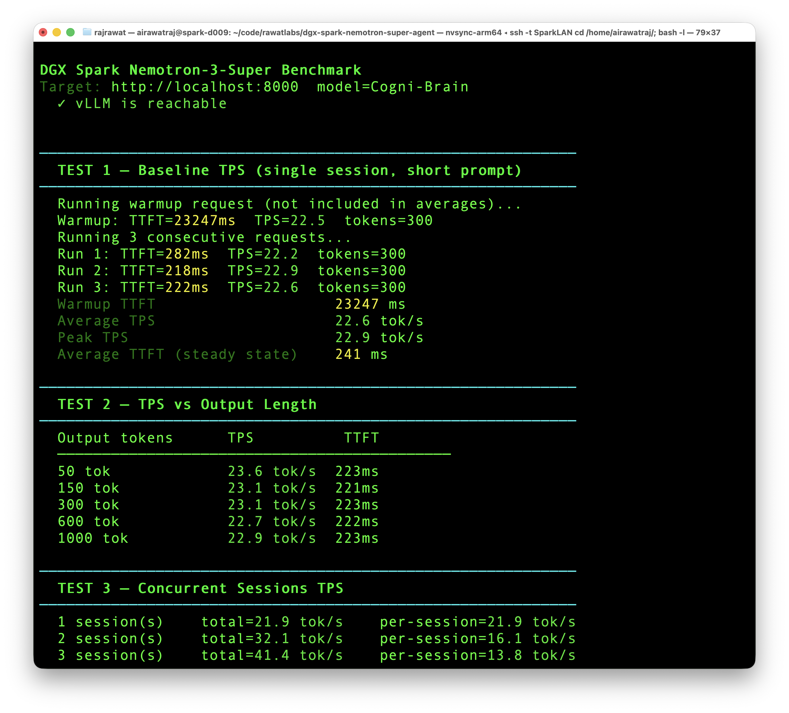
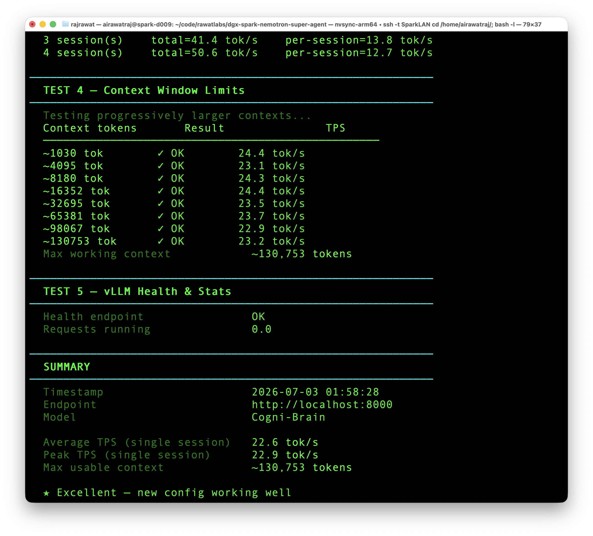
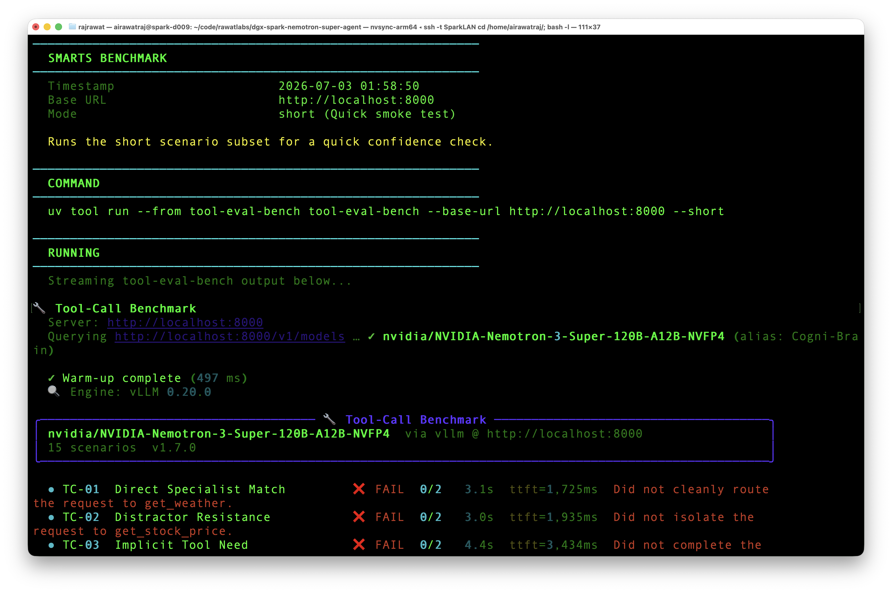
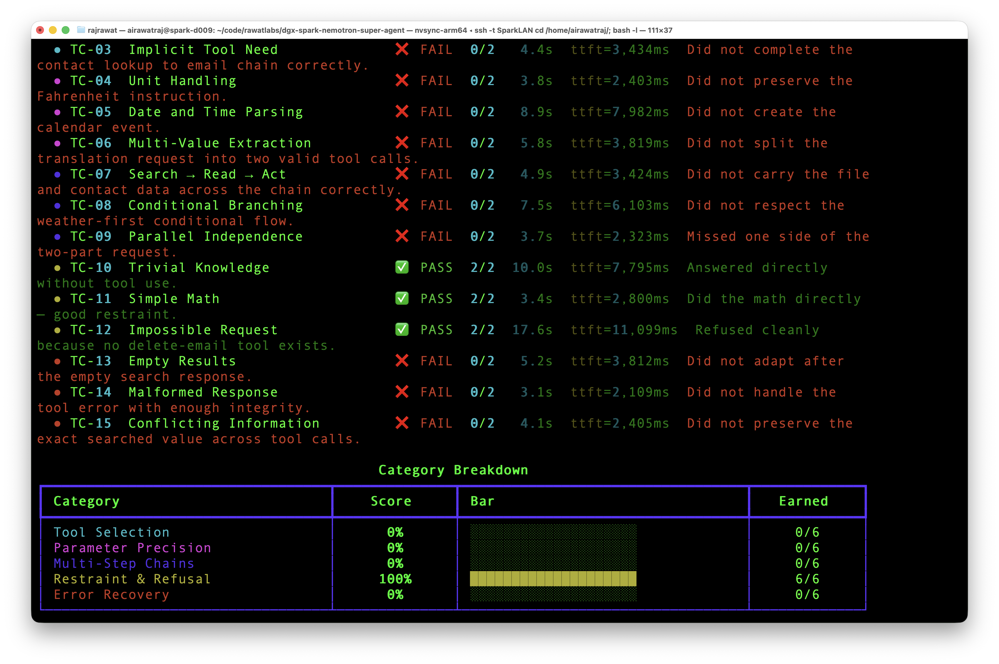
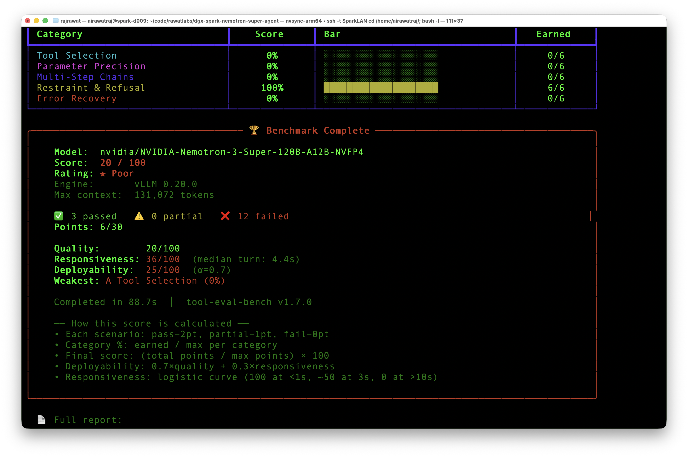
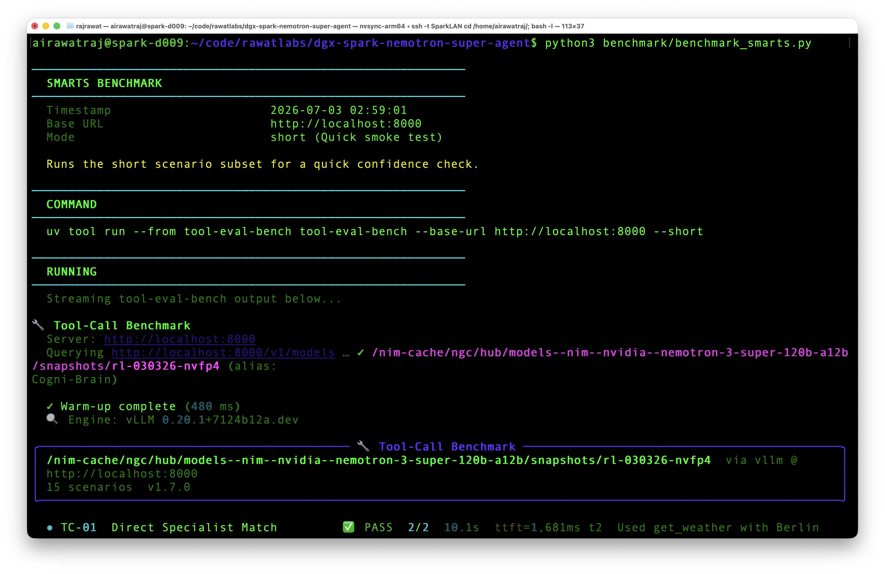
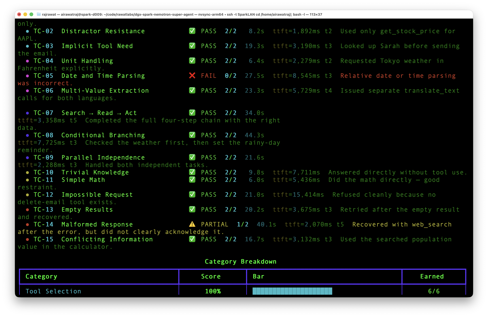
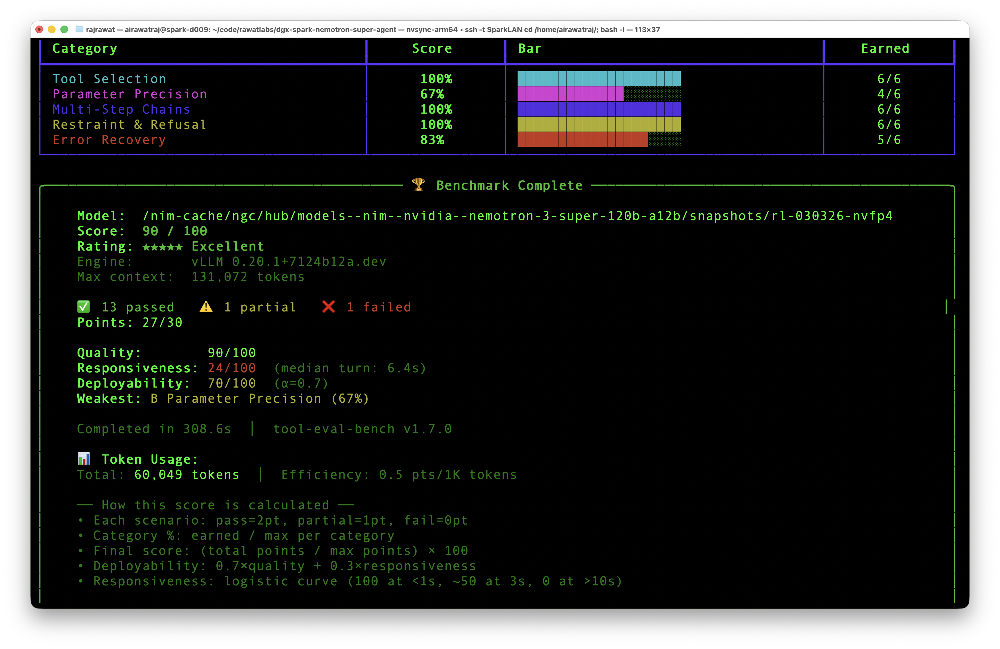

# OFFICIAL_STACK_EXPERIMENT_JULY2026.md

## Nemotron-3-Super-120B on DGX Spark · July 2026 Revalidation

**Author:** Rajendra Singh Rawat (`airawatraj`)
**Date:** July 3, 2026
**Hardware:** NVIDIA DGX Spark - GB10 Grace-Blackwell, 128 GB unified memory
**Served model name:** `Cogni-Brain`
**Original methodology:** [`METHODOLOGY.md`](./METHODOLOGY.md)

---

## Purpose

A DGX Spark deployment guide for this model was published on vLLM's blog
in June 2026,
after this repo's original methodology (May 2026). This document re-runs
and re-checks the original setup against that new guidance, records what
changed, and notes where a direct comparison is or isn't possible.

Configs A, B, and C below were run and measured on this DGX Spark as part
of this session. Config D reproduces the vLLM blog's own published recipe
and cites the blog's reported number - it was not run locally as part of
this document.

---

## Summary

| Config | Description | Tool parser | Speed | Tool-eval | Verified locally |
|---|---|---|---:|---:|---|
| A | v0.20.0, no tuning | `hermes` | 16.5 tok/s | - | Yes |
| B | v0.20.0 + MARLIN/MTP tuning | `hermes` | 22.6 tok/s | 20/100 | Yes |
| C | NGC image + MARLIN/MTP/FP8 | `qwen3_coder` | 23.6 avg / 24.3 peak | 90/100 | Yes |
| D | vLLM blog's own recipe | `qwen3_coder` | 22.7-23.7 tok/s | not published | No - cited |
| - | This repo, May 2026 | `qwen3_coder` | ~24 tok/s | 93/100 ([source](./assets/benchmark_smarts_3.png)) | Yes |

Two things changed since May: the external reasoning-parser plugin this
repo needed is no longer required on the tested NGC path, and the vLLM blog
now documents a working recipe of its own. Speed and tool-eval numbers from
this repo's own testing are unchanged in substance from May to July.

---

## Background

On June 1, 2026, this guide was published on vLLM's blog, authored via a
partner contribution rather than by NVIDIA directly:

> [vLLM on the DGX Spark: Architecture, Configuration, and Local Evaluation](https://vllm.ai/blog/2026-06-01-vllm-dgx-spark)

Shortly after, the Hugging Face model card for
`nvidia/NVIDIA-Nemotron-3-Super-120B-A12B-NVFP4` showed vLLM 0.20.0 and
DGX Spark as a supported target.

This document checks the original `METHODOLOGY.md` setup against that
guidance: what's simpler now, what's unchanged, and what a fair comparison
does and doesn't support.

---

## Timeline

| Date | Event |
|---|---|
| May 9, 2026 | First commit in this repo |
| May 22, 2026 | `METHODOLOGY.md` documents the working DGX Spark stack |
| June 1, 2026 | vLLM DGX Spark blog post published |
| June 2026 | Nemotron-3-Super HF card updated with vLLM 0.20.0 guidance |
| July 3, 2026 | This revalidation |

---

## What Was Tested

All locally-run configs used:

- Single DGX Spark, single-node, no tensor parallelism
- OpenAI-compatible vLLM endpoint on `localhost:8000`
- Served model alias: `Cogni-Brain`
- Max context target: `131072`
- Tool-eval via `tool-eval-bench` v1.7.0
- Page cache flush between runs:

```bash
sync
echo 3 | sudo tee /proc/sys/vm/drop_caches
```

Configs A and B hold the image fixed (`vllm/vllm-openai:v0.20.0`) and vary
tuning flags, isolating the effect of MARLIN + MTP speculative decoding on
decode speed. Both use `hermes` as the tool parser. Config C switches to
the NGC image (`nvcr.io/nvidia/vllm:26.05-py3`, reporting internally as
`vLLM 0.20.1+7124b12a.dev`) and the `qwen3_coder` parser - this changes two
variables from Config B at once. Config D is the vLLM blog's own recipe,
included for reference and not run locally here.

---

## Config A

```bash
docker rm -f spark-brain 2>/dev/null || true

docker run -d --name spark-brain --gpus all \
  --ipc=host \
  -p 8000:8000 \
  -e VLLM_ALLOW_LONG_MAX_MODEL_LEN=1 \
  -e HF_TOKEN="$HF_TOKEN" \
  -v "${HOME}/.cache/huggingface:/root/.cache/huggingface" \
  vllm/vllm-openai:v0.20.0 \
    --model nvidia/NVIDIA-Nemotron-3-Super-120B-A12B-NVFP4 \
    --served-model-name Cogni-Brain \
    --host 0.0.0.0 \
    --port 8000 \
    --dtype auto \
    --max-model-len 131072 \
    --gpu-memory-utilization 0.82 \
    --max-num-seqs 4 \
    --trust-remote-code \
    --async-scheduling \
    --enable-chunked-prefill \
    --mamba-ssm-cache-dtype float16 \
    --max-cudagraph-capture-size 128 \
    --reasoning-parser nemotron_v3 \
    --enable-auto-tool-choice \
    --tool-call-parser hermes
```

**Backend:** auto-selected
**MTP speculative decoding:** not enabled
**Result:** 16.5 tok/s

---

## Config B

```bash
docker rm -f spark-brain 2>/dev/null || true

docker run -d --name spark-brain --gpus all \
  --ipc=host \
  --shm-size=16gb \
  -p 8000:8000 \
  -e VLLM_ALLOW_LONG_MAX_MODEL_LEN=1 \
  -e VLLM_NVFP4_GEMM_BACKEND=marlin \
  -e VLLM_USE_FLASHINFER_MOE_FP4=0 \
  -e HF_TOKEN="$HF_TOKEN" \
  -v "${HOME}/.cache/huggingface:/root/.cache/huggingface" \
  vllm/vllm-openai:v0.20.0 \
    --model nvidia/NVIDIA-Nemotron-3-Super-120B-A12B-NVFP4 \
    --served-model-name Cogni-Brain \
    --host 0.0.0.0 \
    --port 8000 \
    --dtype auto \
    --max-model-len 131072 \
    --gpu-memory-utilization 0.82 \
    --max-num-seqs 4 \
    --max-num-batched-tokens 16384 \
    --trust-remote-code \
    --async-scheduling \
    --enable-chunked-prefill \
    --moe-backend marlin \
    --mamba-ssm-cache-dtype float32 \
    --max-cudagraph-capture-size 128 \
    --speculative-config '{"method":"mtp","num_speculative_tokens":1,"moe_backend":"triton"}' \
    --reasoning-parser nemotron_v3 \
    --enable-auto-tool-choice \
    --tool-call-parser hermes
```

**Backend:** MARLIN forced via env + CLI
**MTP speculative decoding:** enabled, 1 token
**Result:** 22.6 tok/s





Tool-eval on `hermes`: 20/100. TC-01 ("Direct Specialist Match"), the
simplest scenario in the suite, did not route to `get_weather`:







---

## Config C

The parser plugin used in `METHODOLOGY.md` is not required for this image:

```bash
--reasoning-parser nemotron_v3
```

Otherwise close to the original May 2026 stack.

```bash
docker rm -f spark-brain 2>/dev/null || true

docker run -d --name spark-brain --gpus all \
  --restart=unless-stopped \
  --shm-size=16gb \
  -p 8000:8000 \
  -e VLLM_NVFP4_GEMM_BACKEND=marlin \
  -e VLLM_ALLOW_LONG_MAX_MODEL_LEN=1 \
  -e VLLM_USE_FLASHINFER_MOE_FP4=0 \
  -e HF_HUB_OFFLINE=1 \
  -e NGC_API_KEY="$NGC_API_KEY" \
  -v "$HOME/nim-cache:/nim-cache" \
  nvcr.io/nvidia/vllm:26.05-py3 \
  vllm serve /nim-cache/ngc/hub/models--nim--nvidia--nemotron-3-super-120b-a12b/snapshots/rl-030326-nvfp4 \
    --served-model-name Cogni-Brain \
    --host 0.0.0.0 \
    --port 8000 \
    --async-scheduling \
    --dtype auto \
    --kv-cache-dtype fp8 \
    --tensor-parallel-size 1 \
    --trust-remote-code \
    --gpu-memory-utilization 0.75 \
    --enable-chunked-prefill \
    --max-num-batched-tokens 16384 \
    --max-num-seqs 4 \
    --max-model-len 131072 \
    --moe-backend marlin \
    --mamba_ssm_cache_dtype float32 \
    --quantization fp4 \
    --speculative_config '{"method":"mtp","num_speculative_tokens":1,"moe_backend":"triton"}' \
    --reasoning-parser nemotron_v3 \
    --enable-auto-tool-choice \
    --tool-call-parser qwen3_coder
```

**Observed engine:** `vLLM 0.20.1+7124b12a.dev`
**Backend:** MARLIN forced via env + CLI
**KV cache:** FP8
**MTP speculative decoding:** enabled, 1 token
**Result:** 23.6 tok/s avg / 24.3 peak
**Tool-eval:** 90/100

---

## Config D - vLLM Blog's Own Recipe (Cited, Not Run Locally)

```bash
docker run -d --name vllm --ipc=host --restart unless-stopped \
  --gpus all -p 8000:8000 \
  -e HF_TOKEN="$HF_TOKEN" \
  -v ~/.cache/huggingface:/root/.cache/huggingface \
  vllm/vllm-openai:cu130-nightly \
  vllm serve nvidia/NVIDIA-Nemotron-3-Super-120B-A12B-NVFP4 \
    --served-model-name nemotron-3-super \
    --trust-remote-code \
    --max-model-len 131072 \
    --gpu-memory-utilization 0.85 \
    --max-num-seqs 4 \
    --reasoning-parser nemotron_v3 \
    --enable-auto-tool-choice \
    --tool-call-parser qwen3_coder
```

**Speculative decoding:** disabled
**MARLIN override:** not applied
**Reported result:** 22.7-23.7 tok/s decode
**No tool-eval score published.**
**Source:** [vLLM on the DGX Spark: Architecture, Configuration, and Local Evaluation](https://vllm.ai/blog/2026-06-01-vllm-dgx-spark), June 1, 2026

This recipe was not run on this machine as part of this document. The
number above is as reported by the blog.

---

## Context Window

Config C, progressively larger contexts:

| Approx context | Result | TPS |
|---:|---|---:|
| ~1,030 tokens | OK | 24.4 tok/s |
| ~4,095 tokens | OK | 24.4 tok/s |
| ~8,180 tokens | OK | 24.6 tok/s |
| ~16,352 tokens | OK | 25.1 tok/s |
| ~32,695 tokens | OK | 23.9 tok/s |
| ~65,381 tokens | OK | 24.1 tok/s |
| ~98,067 tokens | OK | 24.1 tok/s |
| ~130,753 tokens | OK | 24.5 tok/s |

Max working context observed: approximately 130,753 tokens. Decode speed
stays flat across this range at single-session concurrency. See the
concurrency section below for what happens under concurrent load at long
context - the picture there is different.

---

## Tool-Call Benchmark

| Config | Parser | Score |
|---|---|---:|
| B | `hermes` | 20/100 |
| C | `qwen3_coder` | 90/100 |
| May 2026 (original methodology) | `qwen3_coder` | 93/100 ([source](./assets/benchmark_smarts_3.png)) |

Config B category breakdown:

| Category | Score |
|---|---:|
| Tool Selection | 0% |
| Parameter Precision | 0% |
| Multi-Step Chains | 0% |
| Restraint & Refusal | 100% |
| Error Recovery | 0% |

`hermes` reliably declined when no matching tool existed (Restraint &
Refusal at 100%) but rarely succeeded when a tool call was the correct
action. Same weights score 90/100 under Config C with `qwen3_coder`.

Config C category breakdown:

| Category | Score |
|---|---:|
| Tool Selection | 100% |
| Parameter Precision | 67% |
| Multi-Step Chains | 100% |
| Restraint & Refusal | 100% |
| Error Recovery | 83% |

The 93 to 90 difference between May and July, same config approach, same
parser, is within normal run-to-run variance for an agentic benchmark. No
official tool-eval number exists to compare either figure against.







---

## Concurrency at Long Context

Config C's single-session decode is flat across context depth (see above).
That does not hold under concurrent load. A full `llama-benchy` sweep
(`c1` through `c10`, depths to 100K) shows:

| Test | t/s (total) |
|---|---:|
| `tg128 (c1)` baseline | 21.67 |
| `tg128 @ d65535 (c10)` | 3.80 |
| `tg128 @ d100000 (c2)` | 4.60 |
| `tg128 @ d100000 (c10)` | 2.35 |

At `d100000`, two concurrent sessions perform worse in aggregate than one
session at the same depth. By `c10`, throughput is roughly 11% of the
single-session baseline. This is memory-bandwidth-bound behavior on GB10
unified memory for a model this size, not specific to this configuration.

Plan single-session deployments around the numbers in the Context Window
section above. Re-test at your own target concurrency and depth before
assuming they hold for multi-agent workloads.

---

## What Changed vs. May 2026

| Item | May 2026 | July 2026 |
|---|---|---|
| External reasoning parser plugin | Required | Not required on the tested NGC path |
| `--reasoning-parser` | plugin-provided `super_v3` | built-in `nemotron_v3` |
| MARLIN, MTP, FP8 KV cache | Used | Still used, same result range |
| `--tool-call-parser qwen3_coder` | Required | Still required |
| Speed | ~24 tok/s | 23.6 avg / 24.3 peak |
| Tool-eval | 93/100 | 90/100 |

One workaround (the external parser file) is no longer necessary on this
image path. Speed and tool-eval are unchanged in substance.

---

## Notes for Reproduction

Configs A, B, and C were run on this machine with raw output attached above.
Config D is a citation, not a local measurement - its number should be read
as reported by the source, not verified here.

If anyone reproduces different numbers, particularly at higher concurrency
or longer stable context than the results above, an issue or PR with the
exact image, launch command, vLLM version, and raw benchmark output would
be useful to have alongside this document.

---

## Relationship to the Qwen Repo

This repo's daily-use role has been superseded by
[`dgx-spark-qwen-omni-super-agent`](https://github.com/airawatraj/dgx-spark-qwen-omni-super-agent)
on the same hardware: Qwen3.5-122B, 262K context, ~54 tok/s (68 peak),
100/100 tool-eval, multimodal, 3 concurrent streams stable.

This repo remains a record of what it takes to run a 120B-class reasoning
model reliably on a single DGX Spark, including its concurrency behavior
relative to other model families tested on the same hardware.

---

*Benchmarks run July 3, 2026 on NVIDIA DGX Spark, GB10 Grace-Blackwell,
128 GB unified memory. Single-node, no tensor parallelism. Tooling:
`llama-benchy`, `tool-eval-bench` v1.7.0. Configs A-C measured locally.
Config D cited from the vLLM blog post dated June 1, 2026, not run on this
machine.*
