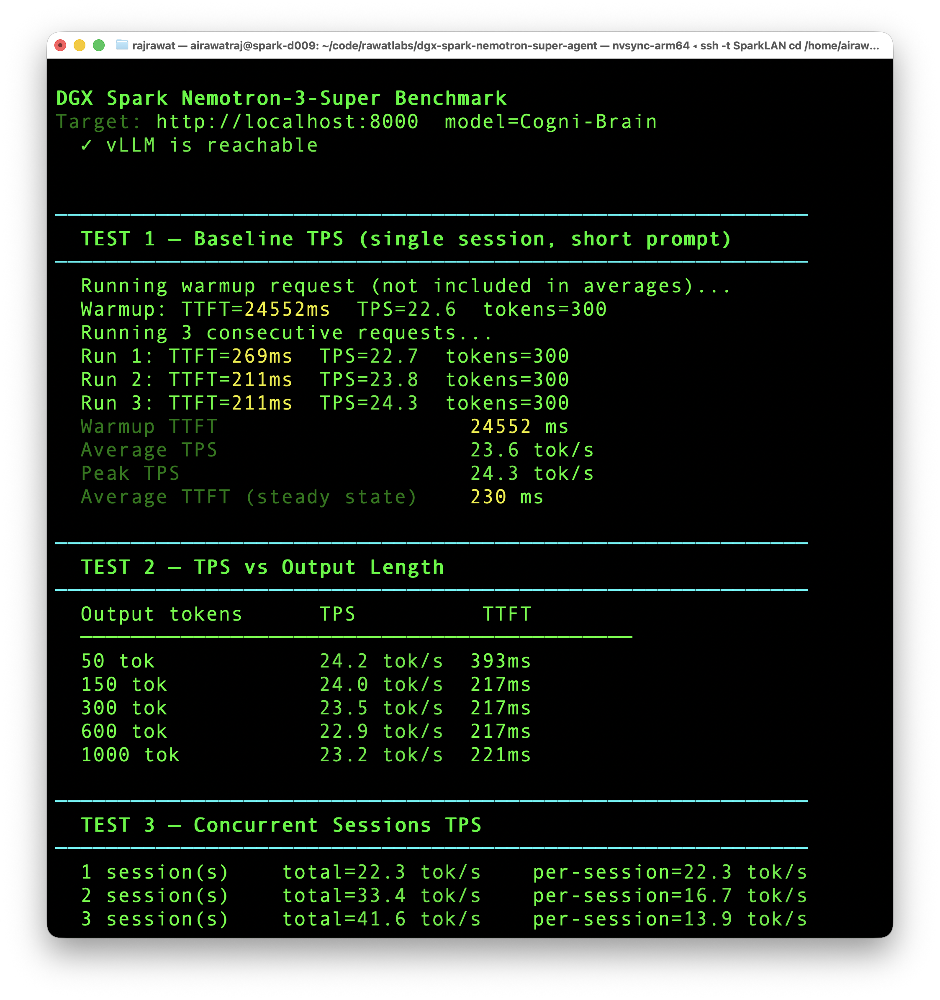
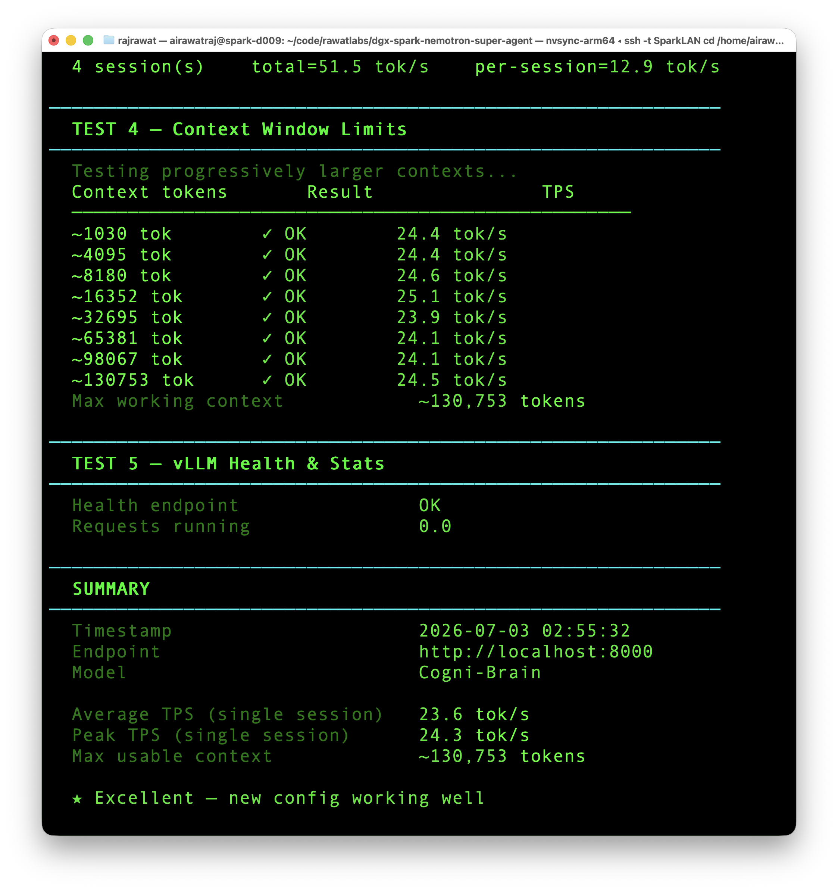

# OFFICIAL_STACK_EXPERIMENT_JULY2026.md

## Nemotron-3-Super-120B on DGX Spark · July 2026 Official-Stack Re-Test

**Author:** Rajendra Singh Rawat (`airawatraj`)  
**Date:** July 3, 2026  
**Hardware:** NVIDIA DGX Spark - GB10 Grace-Blackwell, 128 GB unified memory  
**Served model name:** `Cogni-Brain`  
**Original methodology:** [`METHODOLOGY.md`](./METHODOLOGY.md)

---

## TL;DR

> **Question:** Does the newer public vLLM / DGX Spark guidance replace the
> setup documented in this repo?
>
> **Answer:** No. The recommended setup remains this repo's original tuned path.
>
> The July 2026 re-test shows that the newer public stack is useful, but it
> does not beat the original repo-style run on the same DGX Spark.
>
> | Path | Result |
> |---|---:|
> | Public vLLM image baseline, no Spark-specific tuning | **16.5 tok/s** |
> | Public vLLM image + Spark tuning | **22.6 tok/s** |
> | NGC image + original repo tuning | **23.6 tok/s avg / 24.3 peak** |
> | Best July tool-eval result | **90 / 100** |
> | Original May 2026 tool-eval result | **93 / 100** |
>
> One setup step is simpler now: in the NGC/vLLM path tested here,
> `--reasoning-parser nemotron_v3` works without the old external
> `super_v3_reasoning_parser.py` plugin.
>
> The main lesson did not change: for a first-time user, start with
> [`METHODOLOGY.md`](./METHODOLOGY.md). This file is the July 2026 validation
> run, not a replacement runbook.

---

## Background

On June 1, 2026, the vLLM team published:

> [vLLM on the DGX Spark: Architecture, Configuration, and Local Evaluation](https://vllm.ai/blog/2026-06-01-vllm-dgx-spark)

Shortly after, the Hugging Face model card for
`nvidia/NVIDIA-Nemotron-3-Super-120B-A12B-NVFP4` showed vLLM 0.20.0 and
DGX Spark as a supported target.

That raised the obvious question for this repo:

**Did the later official/public path finally replace the custom setup
documented in `METHODOLOGY.md`?**

This follow-up answers that question with a fresh July 2026 run.

---

## Timeline

| Date | Event |
|---|---|
| May 9, 2026 | First commit in this repo |
| May 22, 2026 | `METHODOLOGY.md` documents the working DGX Spark stack |
| June 1, 2026 | vLLM DGX Spark blog post published |
| June 2026 | Nemotron-3-Super HF card updated with vLLM 0.20.0 guidance |
| July 3, 2026 | This official-stack re-test run |

This repo documented the working DGX Spark configuration before the later
public documentation became available. The later documentation is useful, but
the working baseline came from the earlier hands-on setup work in this repo.

---

## What Was Tested

Three configurations were tested on the same DGX Spark hardware in sequence.

All runs used:

- Single DGX Spark
- Single-node inference
- No tensor parallelism
- OpenAI-compatible vLLM endpoint on `localhost:8000`
- Served model alias: `Cogni-Brain`
- Max context target: `131072`
- Tool-eval benchmark through the OpenAI-compatible API
- Page cache flush between major runs where applicable:

```bash
sync
echo 3 | sudo tee /proc/sys/vm/drop_caches
```

**A note on what each config isolates.** Configs A and B stay on the public
vLLM 0.20.0 image line and vary the Spark-specific tuning flags, which
isolates the main throughput impact of carrying forward the repo tuning:
**+6.1 tok/s** (16.5 to 22.6).

Config C is different. It is not a single-variable A/B test against Config B.
It changes the runtime path to the NVIDIA-maintained NGC image, uses the local
NGC checkpoint path, enables the original repo's FP8 KV / FP4 / MARLIN stack,
uses a more conservative memory target, and restores `qwen3_coder` tool-call
parsing.

That means the B-to-C result should not be read as proof that one individual
flag caused the additional gain. Config C is included because it represents
the best full working stack found in this repo, not because it isolates a
single variable.

---

## Config A - Public vLLM Image Baseline, No Spark-Specific Tuning

This is a public DockerHub vLLM image baseline. It intentionally does **not**
use the full Spark/Nemotron tuning stack.

This is **not** the most aggressive Hugging Face model-card recipe. The HF
card includes additional Spark-specific flags in some examples, including
MARLIN, FP8 KV, speculative decoding, and parser-plugin options. Config A is
included to answer a narrower question:

> What happens if I start from the public image without carrying forward the
> repo's original Spark-specific tuning?

```bash
docker rm -f spark-brain 2>/dev/null || true

docker run -d --name spark-brain --gpus all \
  --ipc=host \
  -p 8000:8000 \
  -e VLLM_ALLOW_LONG_MAX_MODEL_LEN=1 \
  -e HF_TOKEN="$HF_TOKEN" \
  -v "${HOME}/.cache/huggingface:/root/.cache/huggingface" \
  vllm/vllm-openai:v0.20.0 \
    --model nvidia/NVIDIA-Nemotron-3-Super-120B-A12B-NVFP4 \
    --served-model-name Cogni-Brain \
    --host 0.0.0.0 \
    --port 8000 \
    --dtype auto \
    --max-model-len 131072 \
    --gpu-memory-utilization 0.82 \
    --max-num-seqs 4 \
    --trust-remote-code \
    --async-scheduling \
    --enable-chunked-prefill \
    --mamba-ssm-cache-dtype float16 \
    --max-cudagraph-capture-size 128 \
    --reasoning-parser nemotron_v3 \
    --enable-auto-tool-choice \
    --tool-call-parser hermes
```

**Observed path:** public vLLM 0.20.0
**Backend:** auto-selected path
**MTP speculative decoding:** not enabled
**Result:** **16.5 tok/s**

---

## Config B - Public Image + Community Spark Tuning

This keeps the public vLLM image but applies the important tuning discovered
during the original repo work: MARLIN, chunked prefill, explicit batching,
Mamba cache dtype, and MTP speculative decoding.

```bash
docker rm -f spark-brain 2>/dev/null || true

docker run -d --name spark-brain --gpus all \
  --ipc=host \
  --shm-size=16gb \
  -p 8000:8000 \
  -e VLLM_ALLOW_LONG_MAX_MODEL_LEN=1 \
  -e VLLM_NVFP4_GEMM_BACKEND=marlin \
  -e VLLM_USE_FLASHINFER_MOE_FP4=0 \
  -e HF_TOKEN="$HF_TOKEN" \
  -v "${HOME}/.cache/huggingface:/root/.cache/huggingface" \
  vllm/vllm-openai@sha256:3dbe092ec5b2cef63b6104d33fa75d6ce53a7870962529ada69f78bbbc38e776 \
    --model nvidia/NVIDIA-Nemotron-3-Super-120B-A12B-NVFP4 \
    --served-model-name Cogni-Brain \
    --host 0.0.0.0 \
    --port 8000 \
    --dtype auto \
    --max-model-len 131072 \
    --gpu-memory-utilization 0.82 \
    --max-num-seqs 4 \
    --max-num-batched-tokens 16384 \
    --trust-remote-code \
    --async-scheduling \
    --enable-chunked-prefill \
    --moe-backend marlin \
    --mamba-ssm-cache-dtype float32 \
    --max-cudagraph-capture-size 128 \
    --speculative-config '{"method":"mtp","num_speculative_tokens":1,"moe_backend":"triton"}' \
    --reasoning-parser nemotron_v3 \
    --enable-auto-tool-choice \
    --tool-call-parser hermes
```

**Observed path:** public vLLM image, pinned digest, reporting as vLLM 0.20.0
**Backend:** MARLIN forced via env + CLI
**MTP speculative decoding:** enabled, 1 token
**Result:** **22.6 tok/s**


Tool calling with `hermes` on this public-image path did not reproduce the
original repo's agentic reliability. On the most basic single-tool scenario
in the suite, TC-01 ("Direct Specialist Match"), the model did not cleanly
route the request to `get_weather` at all:


---

## Config C - NGC Image + Original Repo Tuning, Updated Parser

This is the original working repo configuration updated for July 2026.

The only meaningful simplification from the original methodology is that the
external parser plugin is not needed for this image/version path. The command
uses:

```bash
--reasoning-parser nemotron_v3
```

Everything else remains intentionally close to the original stack.

```bash
docker rm -f spark-brain 2>/dev/null || true

docker run -d --name spark-brain --gpus all \
  --restart=unless-stopped \
  --shm-size=16gb \
  -p 8000:8000 \
  -e VLLM_NVFP4_GEMM_BACKEND=marlin \
  -e VLLM_ALLOW_LONG_MAX_MODEL_LEN=1 \
  -e VLLM_USE_FLASHINFER_MOE_FP4=0 \
  -e HF_HUB_OFFLINE=1 \
  -e NGC_API_KEY="$NGC_API_KEY" \
  -v "$HOME/nim-cache:/nim-cache" \
  nvcr.io/nvidia/vllm:26.05-py3 \
  vllm serve /nim-cache/ngc/hub/models--nim--nvidia--nemotron-3-super-120b-a12b/snapshots/rl-030326-nvfp4 \
    --served-model-name Cogni-Brain \
    --host 0.0.0.0 \
    --port 8000 \
    --async-scheduling \
    --dtype auto \
    --kv-cache-dtype fp8 \
    --tensor-parallel-size 1 \
    --trust-remote-code \
    --gpu-memory-utilization 0.75 \
    --enable-chunked-prefill \
    --max-num-batched-tokens 16384 \
    --max-num-seqs 4 \
    --max-model-len 131072 \
    --moe-backend marlin \
    --mamba_ssm_cache_dtype float32 \
    --quantization fp4 \
    --speculative_config '{"method":"mtp","num_speculative_tokens":1,"moe_backend":"triton"}' \
    --reasoning-parser nemotron_v3 \
    --enable-auto-tool-choice \
    --tool-call-parser qwen3_coder
```

**Observed engine:** `vLLM 0.20.1+7124b12a.dev`
**Image:** `nvcr.io/nvidia/vllm:26.05-py3`
**Backend:** MARLIN forced via env + CLI
**KV cache:** FP8
**MTP speculative decoding:** enabled, 1 token
**Tool parser:** `qwen3_coder`
**Result:** **23.6 tok/s avg / 24.3 peak**
**SMARTS score:** **90 / 100**

This is the best working NVIDIA-maintained path I found for Nemotron-3-Super
on DGX Spark.

---

## Speed Results

| Config | Image | Avg TPS | Peak TPS | Max Context |
|---|---|---:|---:|---:|
| A - Public vLLM baseline, no Spark-specific tuning | `vllm/vllm-openai:v0.20.0` | **16.5 tok/s** | 16.5 tok/s | 131,072 |
| B - Public image + Spark tuning | `vllm/vllm-openai:v0.20.0`, pinned digest | **22.6 tok/s** | 22.9 tok/s | 131,072 |
| C - NGC + original repo tuning | `nvcr.io/nvidia/vllm:26.05-py3` | **23.6 tok/s** | 24.3 tok/s | 131,072 |

Config C is stable at roughly 23-24 tok/s across the tested context range.
As noted above, the B-to-C result reflects the full NGC/original-repo runtime
path, not a single isolated flag or image change.





---

## Context Window Result

Config C was tested progressively across increasing prompt sizes.

| Approx context | Result | TPS |
|---:|---|---:|
| ~1,030 tokens | OK | 24.4 tok/s |
| ~4,095 tokens | OK | 24.4 tok/s |
| ~8,180 tokens | OK | 24.6 tok/s |
| ~16,352 tokens | OK | 25.1 tok/s |
| ~32,695 tokens | OK | 23.9 tok/s |
| ~65,381 tokens | OK | 24.1 tok/s |
| ~98,067 tokens | OK | 24.1 tok/s |
| ~130,753 tokens | OK | 24.5 tok/s |

**Max working context observed:** approximately **130,753 tokens**

The important part is not just that the server accepts a 131K context setting.
The important part is that decode speed does not collapse at the top of the
window **at single-session concurrency**. This does not extend to concurrent
long-context load; see the concurrency caveat under the `llama-benchy` full
run below.

---

## Tool-Call Benchmark - SMARTS

Tool-agent behaviour was tested using `tool-eval-bench` v1.7.0.

| Config | Parser | Score | Rating |
|---|---|---:|---|
| B - Public image + Spark tuning | `hermes` | **20 / 100** | Poor |
| C - NGC + original repo tuning | `qwen3_coder` | **90 / 100** | Excellent |
| Original repo, May 2026 | `qwen3_coder` | **93 / 100** | Excellent |

Config B category breakdown (`hermes` parser, public image):

| Category | Score | Earned |
|---|---:|---:|
| Tool Selection | 0% | 0 / 6 |
| Parameter Precision | 0% | 0 / 6 |
| Multi-Step Chains | 0% | 0 / 6 |
| Restraint & Refusal | 100% | 6 / 6 |
| Error Recovery | 0% | 0 / 6 |

Config B raw summary:

```text
Score: 20 / 100
Rating: Poor
Passed: 3
Partial: 0
Failed: 12
Quality: 20 / 100
Responsiveness: 36 / 100
Deployability: 25 / 100
Weakest category: Tool Selection (0%)
```

The `hermes` parser on this stack reliably declined to call tools when it
had no matching tool (`Restraint & Refusal` at 100%), but essentially never
succeeded when a tool call was actually the correct action. This is a
parser/format mismatch, not a model capability issue - the same weights
score 90/100 with `qwen3_coder` in Config C below.

Config C July 2026 category breakdown (`qwen3_coder` parser, NGC image):

| Category | Score | Earned |
|---|---:|---:|
| Tool Selection | 100% | 6 / 6 |
| Parameter Precision | 67% | 4 / 6 |
| Multi-Step Chains | 100% | 6 / 6 |
| Restraint & Refusal | 100% | 6 / 6 |
| Error Recovery | 83% | 5 / 6 |

Config C summary:

```text
Score: 90 / 100
Rating: Excellent
Passed: 13
Partial: 1
Failed: 1
Quality: 90 / 100
Responsiveness: 24 / 100
Deployability: 70 / 100
Weakest category: Parameter Precision
```


---

## Key Findings

### 1. The public baseline is not the performance path

The public vLLM image baseline reached **16.5 tok/s** in this run. That is
below the original repo baseline.

The model and hardware are capable of more. The difference is configuration.

For DGX Spark, the performance path still requires explicit tuning:

- MARLIN backend
- FP8 KV cache
- MTP speculative decoding
- explicit batch-token cap
- conservative memory allocation
- appropriate Mamba cache dtype

### 2. MARLIN still matters on DGX Spark

The original methodology forced MARLIN because the automatic path was not
reliably selecting the best kernel for this hardware/profile.

That remains true in July 2026 for the tested path.

The tuned public image improved from **16.5 tok/s** to **22.6 tok/s** after
Spark-specific tuning. The NGC image plus original tuning reached **23.6 tok/s
avg / 24.3 tok/s peak**.

### 3. The `qwen3_coder` tool-parser war story is still true

`METHODOLOGY.md` documented `--tool-call-parser qwen3_coder` as the working
compromise for tool calling on this stack.

The July 2026 run confirms the same operational lesson, and this time with
full raw output attached rather than a summary claim.

The 70-point gap tracks the parser/runtime path: `hermes` on the public image
fails the agentic benchmark, while `qwen3_coder` on the NGC image restores the
behaviour documented in the original methodology.

Observed result:

- `hermes` on public image path: **20 / 100 SMARTS** (3 passed, 0 partial, 12 failed)
- `qwen3_coder` on NGC path: **90 / 100 SMARTS** (13 passed, 1 partial, 1 failed)

On `hermes`, the model failed even the most basic single-tool case - TC-01
("Direct Specialist Match") did not cleanly route to `get_weather`, despite
that being the most straightforward scenario in the suite. Tool Selection,
Parameter Precision, Multi-Step Chains, and Error Recovery all scored 0%.
The only category that scored well was Restraint & Refusal (100%) - the
model correctly declined when no matching tool existed, it just could not
reliably call one when it should have.

For real agent work, throughput is not enough. Tool correctness matters, and
tool correctness on this stack is a function of parser choice, not raw model
capability.

### 4. The NGC image is the best working NVIDIA-maintained path found here

The vLLM blog points to a DGX Spark direction. The HF card gives public vLLM
examples. In this local testing, the strongest result came from the
NVIDIA-maintained NGC image:

```text
nvcr.io/nvidia/vllm:26.05-py3
```

That image reported:

```text
vLLM 0.20.1+7124b12a.dev
```

On this DGX Spark, it delivered the best combination of:

- stable 23-24 tok/s decode
- full 131K usable context
- 90/100 tool-eval score
- OpenAI-compatible serving for NemoHermes / local agents

### 5. The reasoning parser setup is simpler now

The original setup required an external parser plugin:

```text
super_v3_reasoning_parser.py
```

For the NGC/vLLM path tested here, the built-in parser works:

```bash
--reasoning-parser nemotron_v3
```

That removes one setup step, but it does not change the main result: the
original repo tuning remains the best working path found in this experiment.

### 6. The FP4 warning is expected in this tested stack, not fatal

The logs may show a warning like:

```text
WARNING: Your GPU does not have native support for FP4 computation.
Weight-only FP4 compression will be used via the Marlin kernel.
```

This should be interpreted as a vLLM/kernel-path warning for this NVFP4
checkpoint on this GB10 stack, not as a blanket claim that DGX Spark has no
FP4 hardware capability.

The practical result matters more than the warning: with the MARLIN path,
Config C still reaches stable 23-24 tok/s decode.

### 7. Single-session stability does not extend to concurrent long-context load

Config C's single-session (`c1`) decode speed stays in a tight 21.6-24.5
tok/s band from ~1K tokens out to ~131K tokens of context. That result is
real, but it is a single-session result, and it should not be read as "this
stack handles concurrent long-context agents well."

The full `llama-benchy` sweep (`c1` through `c10`, at context depths out to
100K) shows that concurrency and long context compound badly on this
hardware:

| Test | t/s (total) |
|---|---:|
| `tg128 (c1)` baseline | 21.67 |
| `tg128 @ d65535 (c10)` | 3.80 |
| `tg128 @ d100000 (c2)` | 4.60 |
| `tg128 @ d100000 (c10)` | 2.35 |

At `d100000`, two concurrent sessions (4.60 tok/s total) perform *worse*
than a single session at the same depth (24.08 tok/s from the Context
Window Result table above) - concurrency is actively harmful once context
gets large enough on this unified-memory hardware. By `c10` at `d100000`,
throughput has collapsed to roughly 11% of the single-session baseline.

This is expected memory-bandwidth-bound behaviour for a 120B-class model on
GB10 unified memory, not a defect specific to this configuration. But it
means the practical concurrency ceiling for long-context multi-agent
workloads on this stack is well below what the single-session numbers alone
would suggest. Plan single-agent, single-session deployments around the
131K/24 tok/s numbers above. Do not extrapolate them to multi-agent
concurrent long-context use without re-testing.

---

## What Changed vs Original Repo

| Item | Original May 2026 methodology | July 2026 result |
|---|---|---|
| External reasoning parser plugin | Required | Not required for the tested NGC/vLLM path |
| `--reasoning-parser` | plugin-provided `super_v3` | built-in `nemotron_v3` |
| MARLIN env vars | Required | Still required for best tested result |
| MTP speculative decoding | Required for peak baseline | Still required for best tested result |
| FP8 KV cache | Used in tuned config | Still used |
| `--tool-call-parser qwen3_coder` | Required for agent reliability | Still required for best tested result |
| NGC image | Earlier NVIDIA image / nightly path | `nvcr.io/nvidia/vllm:26.05-py3` |
| Performance | ~24 tok/s | ~23-24 tok/s |
| Tool eval | 93 / 100 | 90 / 100 |

One parser-file workaround disappeared for the tested path.

The rest of the war story carries forward.

---

## llama-benchy Full Run - Config C

A full Spark Arena-style `llama-benchy` run was also captured for community
reference.

Raw CSV: [`llama_benchy_full_july2026_not_submitted.csv`](assets/llama_benchy_full_july2026_not_submitted.csv)

> Note: these results are provided as community reference only and have not
> been submitted to Spark Arena. The original repo benchmark results remain
> the authoritative leaderboard submission. Single-session `tg128` in this
> run is slightly below the original result due to run conditions and normal
> run-to-run variance.

Selected results:

| Test | t/s avg | Peak t/s |
|---|---:|---:|
| tg128 c1 baseline | 21.67 ± 0.66 | 25.33 |
| tg128 c2 | 36.98 ± 1.23 | 43.00 |
| tg128 c5 | 35.68 ± 0.58 | 68.67 |
| tg128 c10 | 38.12 ± 0.36 | 66.33 |
| tg128 @ d4096 c1 | 21.98 ± 0.49 | 26.33 |
| tg128 @ d8192 c1 | 22.25 ± 0.37 | 25.67 |
| tg128 @ d16384 c1 | 23.90 ± 0.61 | 26.67 |
| tg128 @ d32768 c1 | 23.00 ± 0.28 | 26.00 |
| tg128 @ d65535 c1 | 22.86 ± 1.38 | 26.33 |
| tg128 @ d100000 c1 | 21.57 ± 0.72 | 24.67 |

Single-session decode is stable from small prompts through large context
depths, as shown above. See Key Finding 7 for what happens once concurrency
is combined with long context - the picture is materially different, and the
raw CSV linked above contains the full `c2`/`c5`/`c10` x depth matrix for
anyone who wants to verify this directly.

---

## Practical Recommendation

For first-time users, use the main repo instructions and original methodology:

[`METHODOLOGY.md`](./METHODOLOGY.md)

Do not treat Config A or Config B as recommended production paths. They are
comparison runs for the newer public vLLM stack.

Config C is the July 2026 validation run closest to the original repo tuning.
It confirms the same practical target:

- 131K context
- ~23-24 tok/s decode, single session
- `qwen3_coder` tool parsing
- conservative memory allocation

The July re-test does not replace the original methodology. It backs it up.

For concurrent long-context workloads, do not extrapolate from the
single-session numbers. See Key Finding 7.

---

## Relationship to the Next Repo

This project has reached its natural conclusion.

Nemotron-3-Super remains a capable text-only reasoning model with a strong
thinking-trace format. But on the same DGX Spark hardware, my current daily
stack has moved to:

**[`dgx-spark-qwen-omni-super-agent`](https://github.com/airawatraj/dgx-spark-qwen-omni-super-agent)**

That repo documents:

- Qwen3.5-122B on DGX Spark
- 262K context
- ~54 tok/s sustained decode
- 68 tok/s observed peak
- 100/100 tool-eval score
- multimodal voice + image capability
- same single DGX Spark hardware

This Nemotron repo remains useful because it documents the hard path:
how to make a 120B-class reasoning model run locally and reliably on a
single DGX Spark.

The Qwen repo documents the next step:
more speed, more context, better tool reliability, and multimodal capability
on the same machine.

---

## Reproducibility and Comparison Notes

These results are from my DGX Spark, my local runtime conditions, and my
agent/tool workloads. They are not meant to be the final word on
Nemotron-3-Super performance.

I would be happy to be proven wrong.

If you can reproduce better results on a single DGX Spark - especially stable
262K or 1M context, higher sustained decode, or stronger tool-agent behaviour -
please open an issue or PR with:

- exact Docker image and digest
- full launch command
- vLLM version
- model path or checkpoint revision
- memory settings
- parser settings
- benchmark command
- raw benchmark output
- tool-eval results, if applicable

I am especially interested in comparing notes on configurations that beat
23-24 tok/s at 131K context while preserving reliable tool calling, and on
configurations that hold up better under concurrent long-context load than
what Key Finding 7 shows here.

---

## Conclusion

The original `METHODOLOGY.md` configuration remains the recommended path for
Nemotron-3-Super-120B on one DGX Spark.

The July 2026 re-test shows:

- public defaults are easier, but slower
- Spark-specific tuning still matters
- `qwen3_coder` still matters for agent tool use
- the reasoning parser setup is simpler on the tested NGC/vLLM path
- single-session stability does not imply concurrent long-context stability

This experiment does not replace the original methodology. It validates it.

---

*Benchmarks run July 3, 2026 on NVIDIA DGX Spark, GB10 Grace-Blackwell,
128 GB unified memory. All tests single-node. No tensor parallelism.
Benchmark tooling: `llama-benchy` and `tool-eval-bench` v1.7.0.*