# Running a Real Local AI Agent on DGX Spark · Nemotron-3-Super-120B

I bought a DGX Spark to do real work: running serious local AI agents and training foundation models from scratch - not to run benchmarks.

*(If you are curious about the training side of this hardware, check out [SageGPT](https://github.com/airawatraj/sage-gpt), my 7.5M parameter Sanskrit SLM trained entirely from scratch on this same machine).*

This repo documents what it took to get [Nemotron-3-Super-120B](https://hfviewer.com/nvidia/NVIDIA-Nemotron-3-Super-120B-A12B-NVFP4) actually working
for real agentic tasks: building apps autonomously, solving puzzles, writing code.

The benchmarks are here because community results ranged from 16–19.5 TPS and I
wanted to understand why mine was different. They're a side effect, not the goal.

> ⚠️ **Personal workstation setup. Not for enterprise use. Use at your own risk.**

> **July 2026 update:** I re-tested the newer public vLLM / DGX Spark stack.
> Result: this repo still holds. For first-time users: start with the repo
> as-is. For details, see
> [`OFFICIAL_STACK_EXPERIMENT_JULY2026.md`](./OFFICIAL_STACK_EXPERIMENT_JULY2026.md).
---

## Real Work, Not Just Benchmarks

### Solving a puzzle the community said no local LLM could crack

I came across a reddit thread that claimed ["There's not a SINGLE local LLM which can solve this logic puzzle"](https://www.reddit.com/r/LocalLLaMA/comments/1mblq5g/theres_not_a_single_local_llm_which_can_solve/) -
only o3 could do it at the time of posting.

Cogni-Brain solved it locally in 3 minutes. (and [Cogni-Brain2](https://github.com/airawatraj/dgx-spark-qwen-super-agent) in about 30 seconds)

<p align="center">
  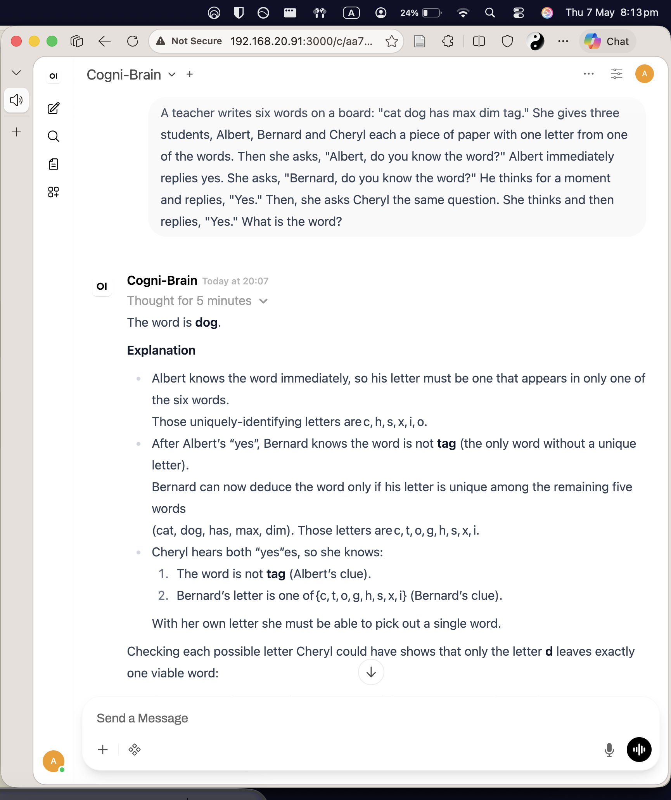
  <br><i>Cogni-Brain reasoning through the Albert-Bernard-Cheryl puzzle</i>
</p>

The same prompt on [NVIDIA's own cloud-hosted endpoint](https://build.nvidia.com/nvidia/nemotron-3-super-120b-a12b) returned an internal server error:

<p align="center">
  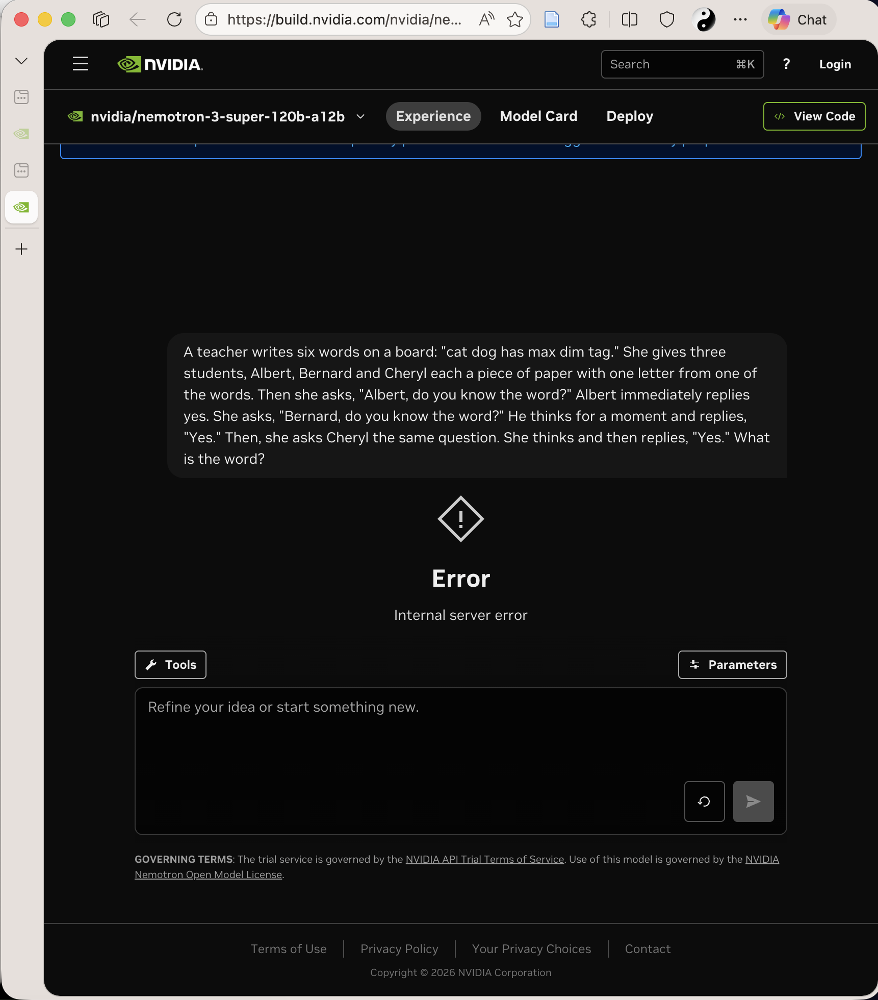
</p>

### 90 minutes of autonomous agentic work

Cogni-Brain built a complete HTML5 chess app via NemoHermes - pawn promotion,
en passant, castling - running 60 tool-call iterations completely autonomously. The agent successfully navigated proxy timeouts and managed a massive 130K context window without crashing the KV cache. Progress updates were delivered to Telegram throughout.

<p align="center">
  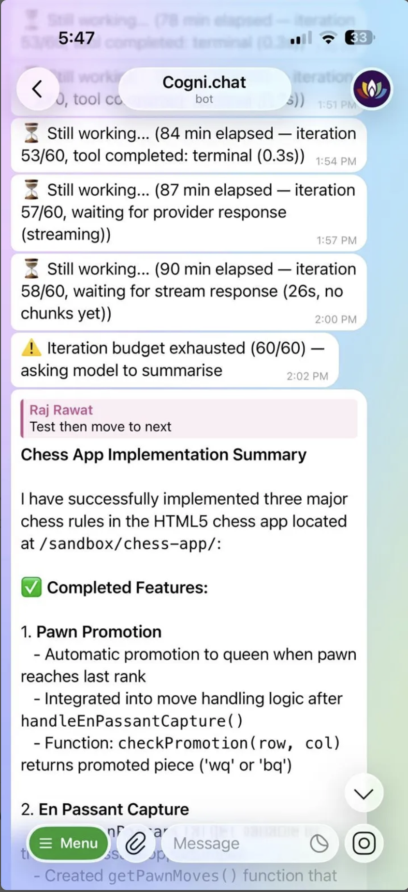
  <br><i>Mobile progress updates via Telegram during the 60-iteration build</i>
</p>

### Coding agent in VS Code

Cogni-Brain running as a coding agent inside VS Code via Continue extension,
analyzing the vLLM codebase - on the same Spark it is running on.

<p align="center">
  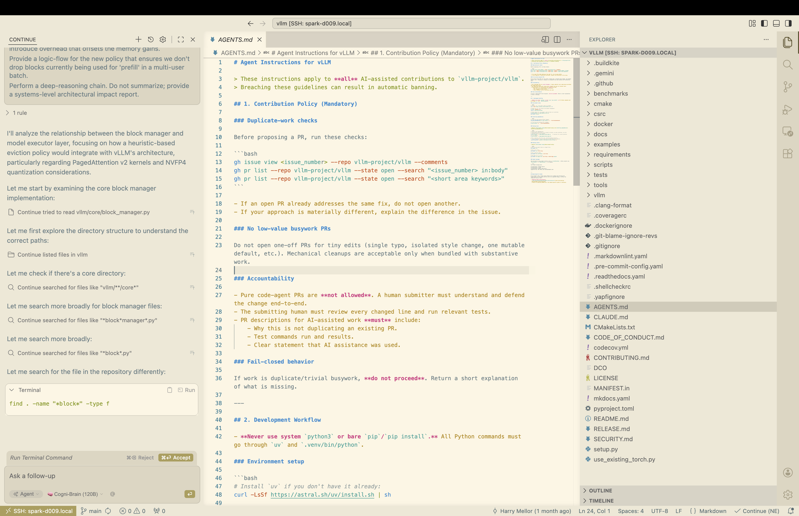
</p>

### Multiple Agentic Interfaces

Cogni-Brain is framework-agnostic and comfortably drives various agent environments on the local hardware.

**Claude Code CLI**
<p align="center">
  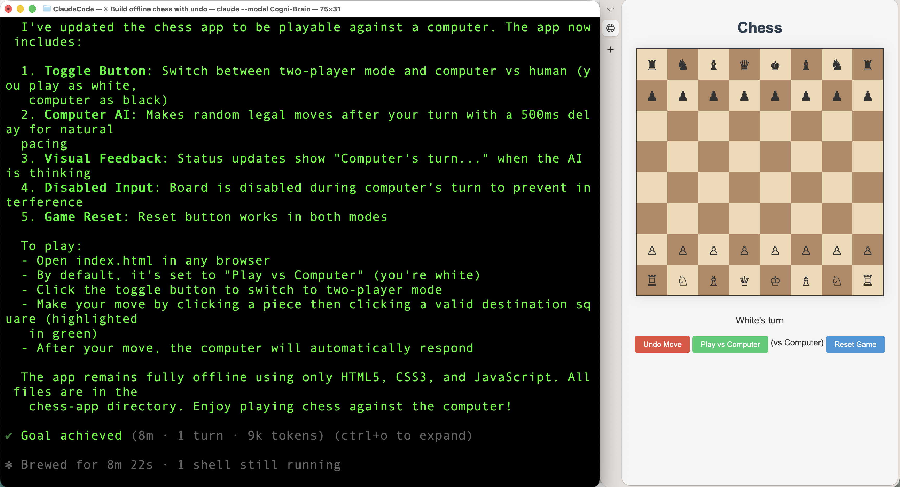
</p>

**NemoHermes TUI**
<p align="center">
  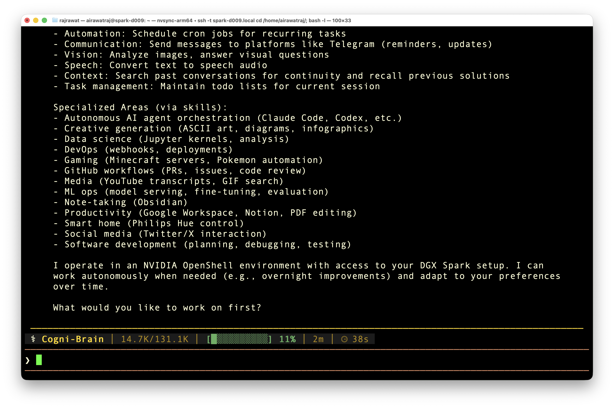
</p>

---

## Benchmark Results

> Results may vary depending on runtime configuration, concurrency, context length, upstream benchmark versions, memory allocation, thermal conditions, and active background services.

### Official spark-arena Submission

> Benchmarked using [llama-benchy](https://github.com/eugr/llama-benchy) with the standardised spark-arena methodology.
> NemoHermes and Open WebUI containers were stopped during this run. Only spark-brain (vLLM) running.
> Published result recorded with `llama-benchy v0.3.8.dev2+gff162bcfc`.

| Metric | Result |
|---|---|
| Single session TPS (tg128) | **23.71 tok/s** |
| Peak TPS (tg128 c5) | **72.67 tok/s** |
| Context stability | **Stable 0 → 100K tokens** |
| Total benchmark tests | 104 |
| Total benchmark duration | **5h 49m** |
| Crashes / OOM errors | **0** |
| KV cache dtype | FP8 |
| Quantization | NVFP4 (Marlin weight-only) |
| Swap during benchmark | 0 bytes |

View full benchmark: [spark-arena.com/benchmark/sub1778644062716](https://spark-arena.com/benchmark/sub1778644062716)

<p align="center">
  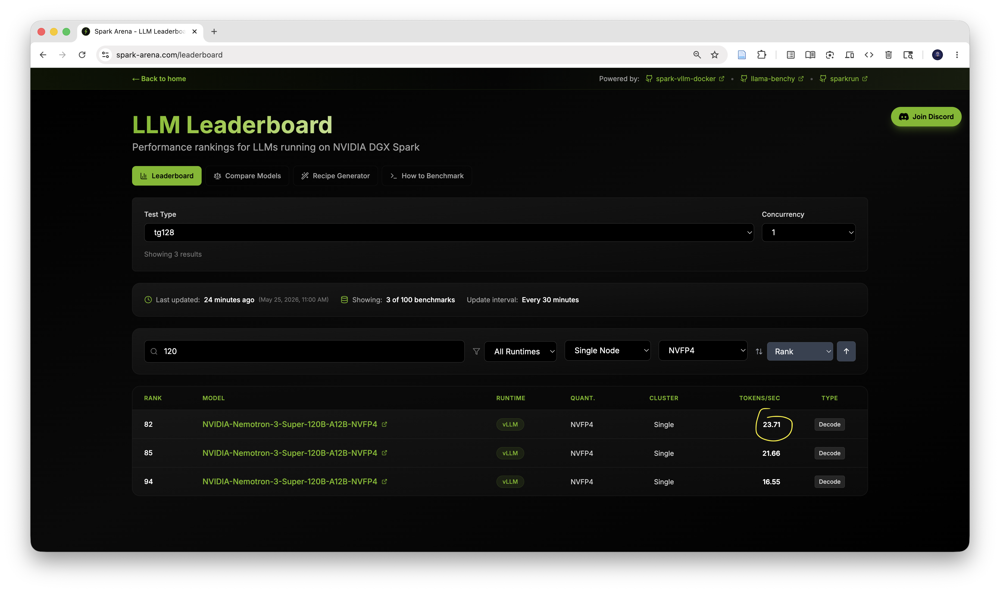
  <br><i>spark-arena community leaderboard — Single Node, NVFP4, vLLM, concurrency 1 — May 14, 2026</i>
</p>

### Custom Script Benchmark (vLLM Only)

> These results were measured with the custom `benchmark_speed.py` script with NemoHermes and Open WebUI containers stopped.
> TPS includes both reasoning (`<think>`) and answer tokens. Isolated TPS would be higher.
> Concurrent-session figures below use the corrected aggregate-throughput calculation in `benchmark_speed.py`.

| Metric | Result |
|---|---|
| Single session TPS (average) | **24.1 tok/s** |
| Single session TPS (peak) | **24.8 tok/s** |
| 4 concurrent sessions (total) | **53.9 tok/s** |
| 3 concurrent sessions (total) | **41.2 tok/s** |
| Max context window | **130,753 tokens** |
| TTFT (steady state) | **229ms** |

<p align="center">
  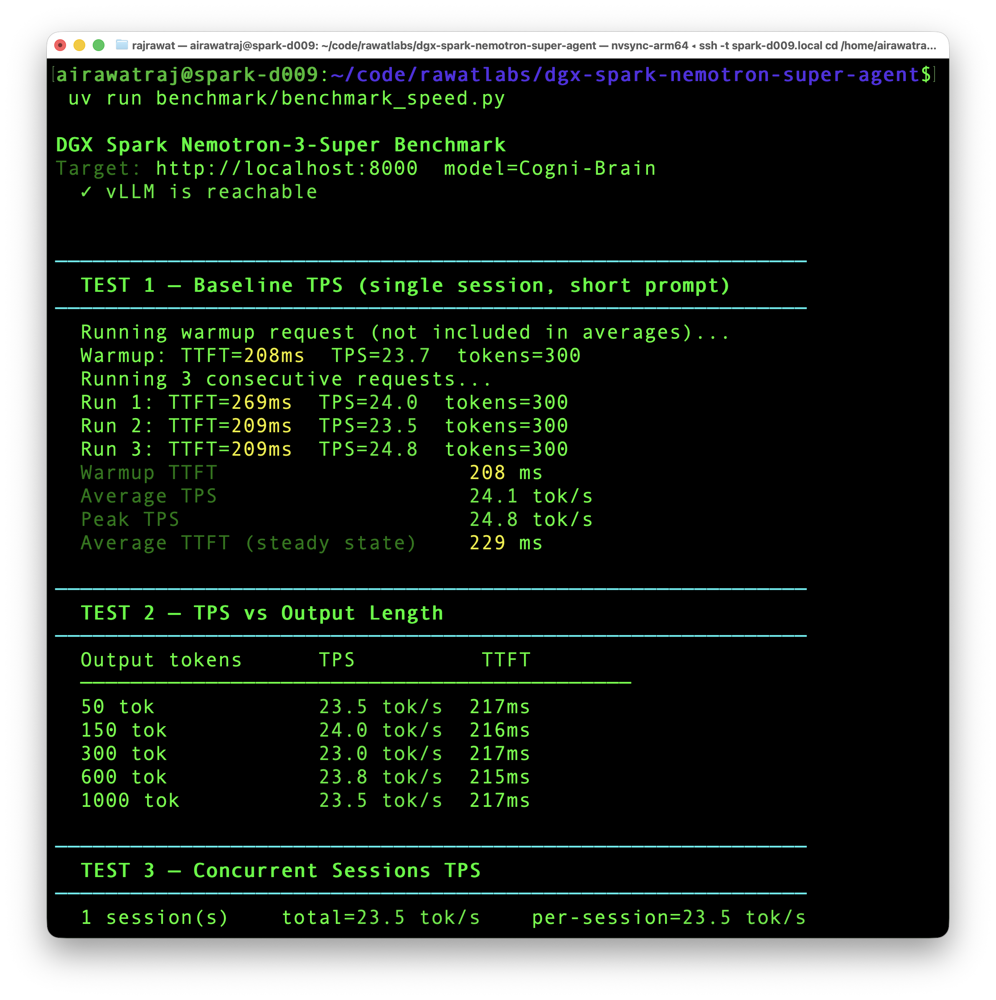
</p>

<p align="center">
  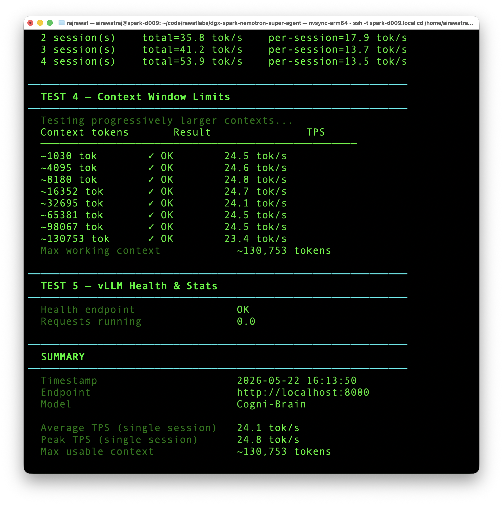
</p>

### Tool-Eval Benchmark

> Benchmarked using `benchmark_smarts.py` in short mode against the local vLLM endpoint.
> This is a capability check for tool selection, parameter precision, multi-step chains,
> refusal behaviour, and recovery from malformed or empty tool responses.
> Published result recorded with `tool-eval-bench v1.7.0`.

| Metric | Result |
|---|---|
| Overall score | **93 / 100** |
| Rating | **★★★★★ Excellent** |
| Scenarios | **15** |
| Passed / Partial / Failed | **14 / 0 / 1** |
| Best categories | **Tool Selection 100%, Multi-Step Chains 100%, Restraint & Refusal 100%, Error Recovery 100%** |
| Weakest category | **Parameter Precision 67%** |
| Responsiveness | **24 / 100** |
| Deployability | **72 / 100** |

<p align="center">
  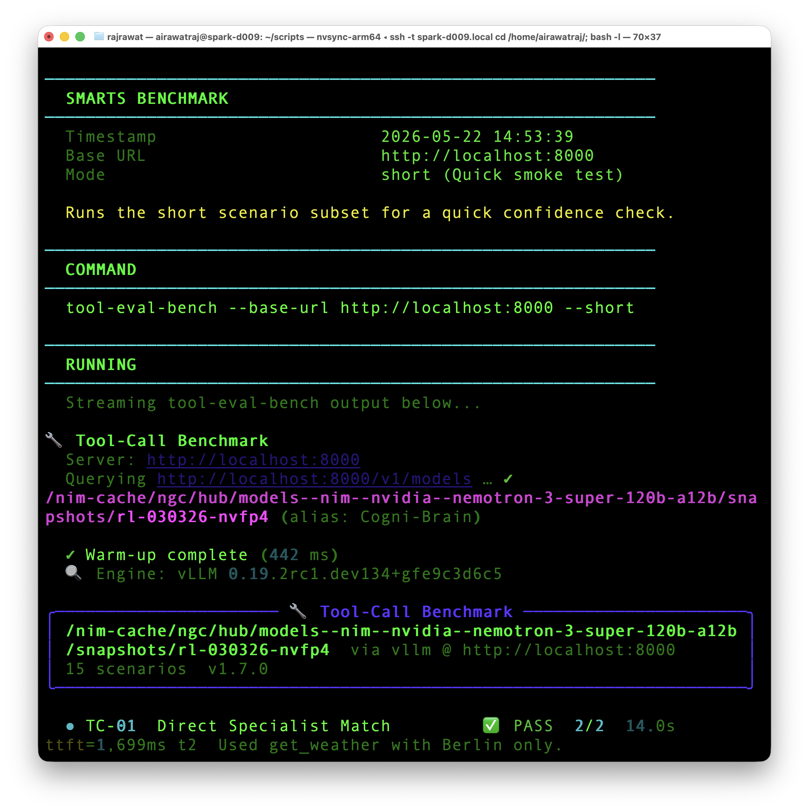
</p>

<p align="center">
  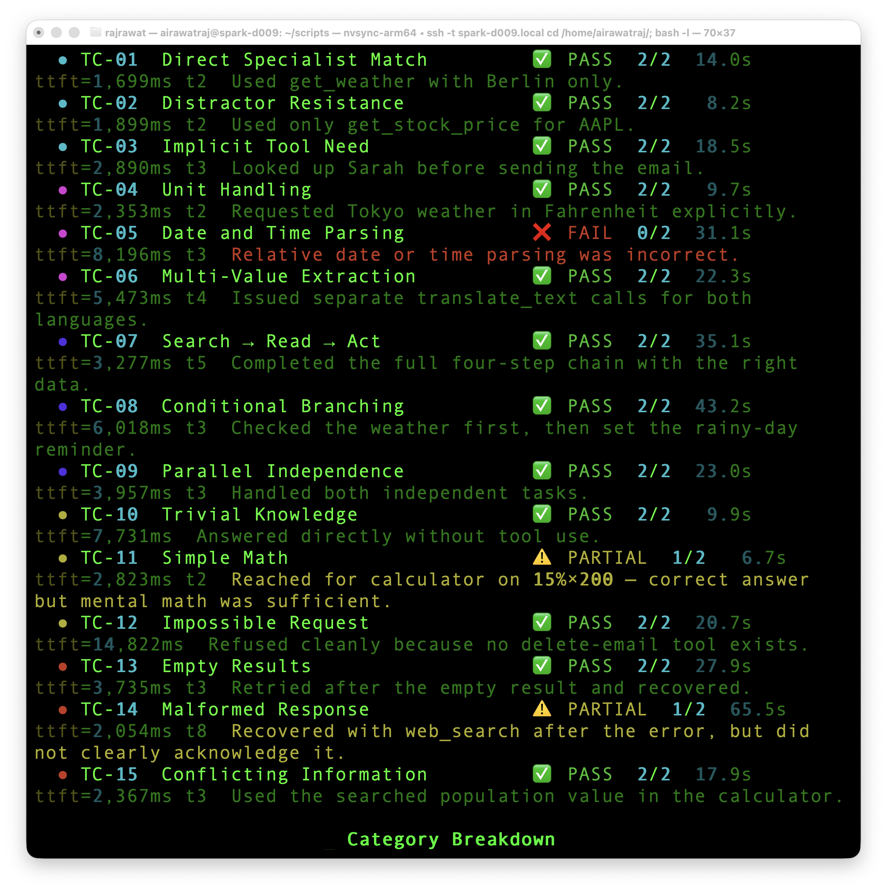
</p>

<p align="center">
  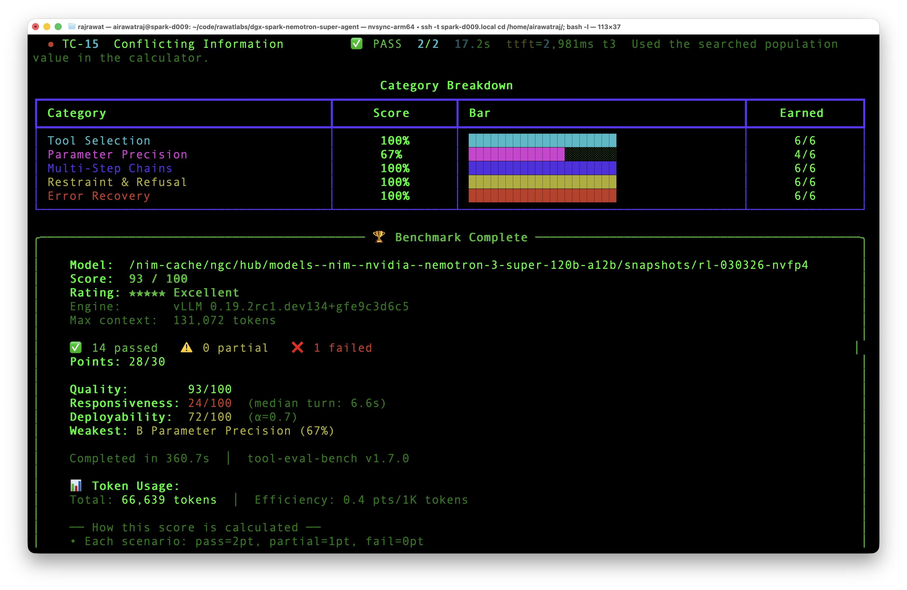
</p>

---

## Compared to Prior Published Results

> **Methodology note:** The [spark-arena leaderboard](https://spark-arena.com/leaderboard) uses a standardised `tg128` test
> (128 fixed output tokens, no production services). The official submission run used this methodology.
>
> **Model note:** This benchmark is specific to **Nemotron-3-Super-120B-A12B-NVFP4** - a reasoning-optimised MoE model.
> Other 120B models (e.g. gpt-oss-120b) use different architectures optimised for throughput rather than deep reasoning
> and are not directly comparable for agentic workloads.


| Who | TPS | Stack | Context | Concurrent |
|---|---|---|---|---|
| **[Cogni-Brain (airawatraj)](https://spark-arena.com/benchmark/sub1778644062716) — official** | **23.71** | NVFP4 + vLLM | 131K | 1 |
| **Cogni-Brain (airawatraj) — custom script** | **24.1** | NVFP4 + vLLM | 131K | 1 |
| **Cogni-Brain (airawatraj) — custom script concurrent** | **53.9** | NVFP4 + vLLM | 131K | 4 |
| [Seth Hobson](https://spark-arena.com/benchmark/a3dd9b9f-d9a6-485b-af72-fd34150a8b7c) (spark-arena, tg128) | 21.66 | NVFP4 + vLLM | 131K | 1 |
| [Seth Hobson](https://spark-arena.com/benchmark/a3dd9b9f-d9a6-485b-af72-fd34150a8b7c) (spark-arena, tg128) | 53.55 | NVFP4 + vLLM | 131K | 5 |
| [Saiyam Pathak](https://saiyampathak.medium.com/heres-what-i-learned-about-nemotron-3-super-i-ran-a-120b-parameter-model-on-nvidia-dgx-spark-fc5b3be12ae1) | 19.5 | Q4_K_M GGUF + llama.cpp | 262K | 1 |
| [Raphael Amorim](https://spark-arena.com/benchmark/55beae02-e7a5-4e8a-98d3-325ba86b4583) | 16.55 | NVFP4 + vLLM | 262K | unknown |
| josephbreda | 16–17 | NVFP4 + vLLM | unknown | 1 |

The official spark-arena submission achieved **23.71 TPS** (tg128, vLLM, NVFP4, Single Node, no production services) —
the highest single-node result I found published for Nemotron-3-Super-120B-A12B-NVFP4 as of May 26, 2026.

TPS remains stable from 0 to 100,000 tokens of context with no performance cliff observed.
Happy to be proved wrong. Let's extract max juice out of Spark.

---

## Hardware & Architecture

- **NVIDIA DGX Spark** (GB10 Grace-Blackwell Superchip)
- **128 GB unified memory** (CPU + GPU shared)
- **Kernel-Level Sandboxing:** The NemoHermes agent stack operates inside an OpenShell environment with K3s, Landlock, and seccomp profiles for isolation during autonomous code generation.
- GPU operating under 75°C throughout

> **Note (Software Limitation):** While the GB10 chip features 5th-gen Tensor Cores capable of FP4, the current vLLM/FlashInfer ecosystem lacks native FP4 MoE kernels for the desktop SM120/SM121 architecture. NVFP4 currently provides weight compression (fitting the model in 128 GB) but forces a fallback to the Marlin dequantization path for compute. See [METHODOLOGY.md](METHODOLOGY.md) for details.

---

## Quick Start

> ⚠️ **Warning:** The setup scripts disable system swap to prevent unified memory thrashing. This is a system-level change.

```bash
# 1. Prerequisites
bash setup/install.sh

# 2. Download model weights
bash setup/download_model.sh

# 3. Download reasoning parser
bash setup/download_parser.sh

# 4. Start vLLM
bash docker/start.sh

# 5. Follow startup logs (~10 min)
docker logs -f spark-brain

# 6. Configure OpenShell Gateway Timeout (Critical for heavy agentic tasks)
openshell inference set -g nemoclaw --provider compatible-endpoint --model Cogni-Brain --timeout 600

# 7. Run benchmarks
uv run benchmark/benchmark_speed.py
# Optional: full spark-arena-style overnight sweep
uv run benchmark/benchmark_speed_arena.py --save-result benchmark/results_full.csv
# Optional: tool-use capability benchmark
uv run benchmark/benchmark_smarts.py
```

The `benchmark_speed_arena.py` and `benchmark_smarts.py` wrappers fetch
`llama-benchy` and `tool-eval-bench` through `uv` on demand, so no separate
global install step is required.

These wrappers intentionally resolve the latest available tool version at run
time. If you are comparing against the published numbers above, note the exact
tool versions recorded with those results.

---

## Repository Structure

```text
dgx-spark-nemotron-super-agent/
├── README.md                    ← this file
├── METHODOLOGY.md               ← full benchmark measurement methodology
├── NEMOHERMES.md                ← hardened agentic stack configuration
├── CITATION.cff                 ← citation metadata
├── setup/
│   ├── install.sh               ← prerequisites, swap disable
│   ├── download_model.sh        ← fetch model weights into NIM cache
│   └── download_parser.sh       ← fetch super_v3_reasoning_parser.py
├── docker/
│   ├── start.sh                 ← launch vLLM (final production command)
│   ├── stop.sh                  ← stop and remove container
│   └── status.sh                ← health check + memory + VmSwap
├── benchmark/
│   ├── benchmark_speed.py       ← TPS, TTFT, context window benchmark
│   ├── benchmark_speed_arena.py ← long spark-arena-style llama-benchy sweep
│   └── benchmark_smarts.py      ← tool-eval-bench capability benchmark
└── assets/                      ← terminal output and real-use images
```

---

## Key Fixes Over Previous Community Setups

| Issue | Old config | Fixed config |
|---|---|---|
| CUDA graphs disabled | `--enforce-eager` | removed |
| Wrong tool parser | `--tool-call-parser hermes` | `qwen3_coder` |
| Marlin backend not set | missing env var | `VLLM_NVFP4_GEMM_BACKEND=marlin` |
| V1 engine disabled | `VLLM_V1_ENABLED=0` | removed |
| FP4 wrong keyword | `--quantization nvfp4` | `fp4` |
| No speculative decoding | missing | MTP `num_speculative_tokens=1` |
| Scheduler throttled | missing flag | `--max-num-batched-tokens 16384` |
| Context mismatch with agent | 65K | 131K (matches NemoHermes config) |

---

## Known Limitations

- Nightly vLLM image - not a stable release
- Uncalibrated FP8 KV cache scaling factors
- Current software stack lacks native FP4 MoE compute kernels for GB10 (SM121), forcing Marlin dequantization fallback
- Single node only (dual-Spark would enable true 1M context)
- Stream stalls under sustained long-running agentic load (NemoHermes retries automatically)

See [METHODOLOGY.md](METHODOLOGY.md) for full details on each limitation.

---

## Feedback Welcome

If you reproduce these results, find errors in the methodology, or achieve higher
numbers - please open an issue or PR. The goal is accurate community benchmarks,
not records.

**Author:** Rajendra Rawat · May 2026
